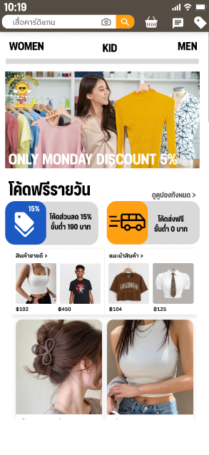

# Web Sunshine – E-Commerce Platform Design

**Web Sunshine** is a Figma UI/UX design prototype for a clothing e-commerce platform, available on both **Web Application** and **Mobile Application**.

The platform includes three main systems:

* **User:** Browse products, categories, favorites, cart, checkout, multiple payment methods, promotions, membership, chat, order history, and real-time delivery tracking.
* **Employee:** Promotion, customer chat, Check In/Out with photo & location verification, accounting, and stock management.
* **Admin:** Employee roles, sales analytics, attendance monitoring, salary, OT, and commission management.

---

## 🔗 Figma Projects

### 🌐 Web Application

Interactive prototype for the **Responsive Web** version.

[**View Web Design on Figma**](https://www.figma.com/design/YbvrcCQ1YkWezTiVdje6cg/Web-Sunshine?node-id=0-1&t=lWkhgL9DnHbDUpbr-1)

### 📱 Mobile Application

Interactive prototype for the **Mobile Application** version.

[**View Mobile App Design on Figma**](https://www.figma.com/design/y2WTxT5RtlzAjYfvmIK781/Design-Application-Sunshine?t=w9mKMIHwxuoY0kt3-1)

---

# 🌐 Web Features

* Home & Product Categories
* Product Details & Favorites
* Shopping Cart & Checkout
* Address Management
* QR Code, KBANK & VISA Payment
* Promotion & Discount Codes
* Membership System
* Customer Chat
* Online Order & Delivery Tracking

### 👨‍💼 Employee

* Promotion & Discount Management
* Customer Chat
* Check In/Out with Photo & Location Verification
* Accounting & Sales History
* Stock Management (Add / Edit / Delete / Price)

### 👑 Admin

* Employee Role Management
* Sales Analytics & Graphs
* Employee Attendance
* Salary, OT & Commission Management

---

# 📱 Mobile Features

* Home & Product Categories
* Product Search & Scanner
* Product Details & 360° View
* Product Ratings & Size Guide
* Size Selection
* Favorites & Shopping Cart
* Shipping Address
* QR Code Payment
* Customer Chat
* Order History
* Delivery Tracking & Delivery Proof
