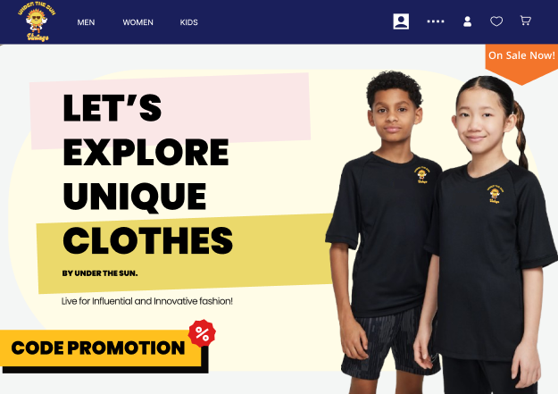

#  Web Sunshine – E-Commerce Platform Design 

**Web Sunshine** is a complete Figma UI/UX design prototype for a clothing e-commerce platform. This project provides tailored interfaces and workflows for three main user roles:

- ** User System:** Browsing products, shopping cart, checkout, and order tracking.
- ** Admin System:** Dashboard, sales analytics, user management, and system settings.
- ** Employee System:** Inventory management, order processing, and daily operations.

---

## 🔗 Figma Live Project
 **[Click here to view interactive prototype on Figma](https://www.figma.com/design/YbvrcCQ1YkWezTiVdje6cg/Web-Sunshine?node-id=0-1&t=lWkhgL9DnHbDUpbr-1)**

---

## 🖼️ Project Overview

---

##  Design Overview & Features
- **Design Tool:** Figma
- **Features:** Auto Layout, Components, Variants, Interactive Prototypes
- **Target Platform:** Web Responsive (Desktop)
